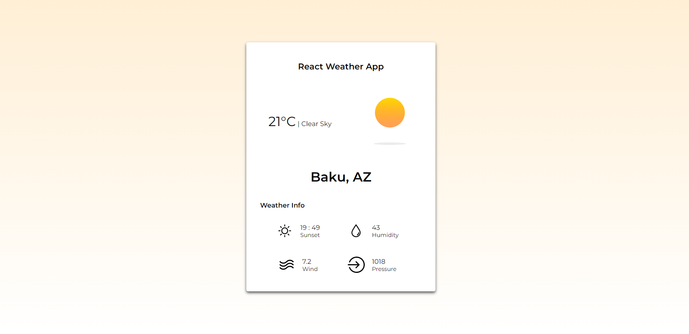

# React Weather App - ReactJS Projects

### Demo - Deployed  Pages 

### APIs Used
[Open Weather APIs](https://openweathermap.org/)

https://openweathermap.org/current

### API Info
* Method: `GET`
* URL: `https://api.openweathermap.org/data/2.5/weather?q={CITY_NAME}&appid={API_KEY}`

### Icons & Font -
* Font Link: `<link href="https://fonts.googleapis.com/css2?family=Montserrat:wght@400;500;600&display=swap" rel="stylesheet">`

### Libraries used
* `styled-components`
* `axios`
* `react-scripts`

